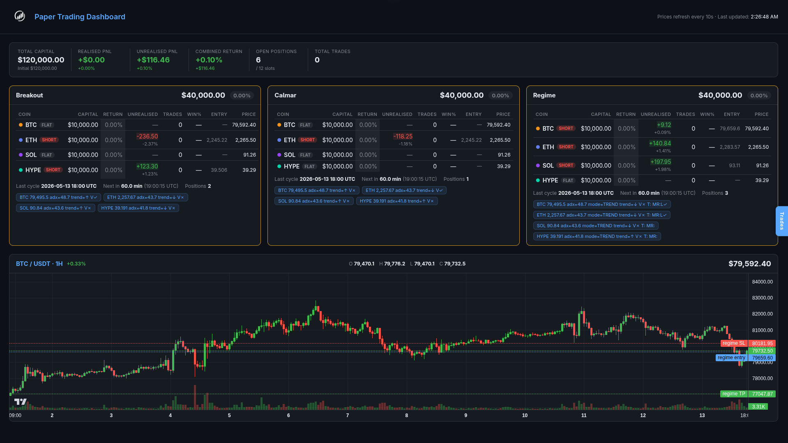

# Crypto Futures Trading Lab

Systematic crypto futures research workspace for **BTC / ETH / SOL / HYPE** (Binance USD-M perpetuals),  
covering data collection, strategy backtesting, parameter optimisation, paper trading, and a live monitoring dashboard.

---

## Dashboard



A Flask-based web dashboard (`dashboard/app.py`) running at **http://localhost:5050** with:

- **Overview bar** — total capital, realised PnL, unrealised PnL, combined return, open positions, trade count
- **Strategy cards** — per-coin capital, return %, unrealised PnL (live), trade count, win rate, entry/current price
- **BTC / USDT 1H candlestick chart** — live K-line data via ccxt, volume histogram, and entry / SL / TP overlay lines for all active positions
- **Trades drawer** — slide-in sidebar (right edge button) showing full trade history per strategy

```bash
# Start dashboard only (crypto conda env required)
/home/bear/Softwares/anaconda3/envs/crypto/bin/python dashboard/app.py

# Or start everything (paper traders + dashboard)
./start_paper_trades.sh
```

---

## Strategies

### 1. Martingale — `backtest_martingale.py`

Bollinger Band mean-reversion with loss-side equal-size averaging and profit-side pyramiding.

| Component | Detail |
|---|---|
| Entry | 1h close touches lower / upper BB band |
| Trend filter | 1d EMA direction |
| Loss adds | Equal-size adds at fixed `GRID_STEP_RATE` intervals |
| Profit adds | Pyramid on BB mid-line cross (decreasing size) |
| TP | Fixed `TP_MARGIN_RATE` × margin from average entry |
| SL | Hard stop when loss reaches `SL_CAPITAL_RATE` × total capital |
| Leverage | 50× |

---

### 2. Trend Breakout — `backtest_breakout.py`

Donchian channel breakout optimised for total return.

| Component | Detail |
|---|---|
| Entry | 1h close breaks Donchian high / low |
| Trend filter | 1d close > EMA(200) |
| Filters | ADX > threshold + volume spike |
| SL / TP | ATR × multiplier / fixed R:R |
| Trailing stop | Optional, ATR-based |
| Leverage | 10–20× |

---

### 3. Calmar-Optimised Breakout — `backtest_calmar.py`

Same breakout mechanics, redesigned for large-capital deployment with conservative drawdown targets.

| Component | Detail |
|---|---|
| Entry | Donchian breakout (immediate or pullback) |
| Sizing | Volatility targeting: `notional = capital × VOL_TARGET / realised_vol` |
| Partial TP | Close 50 % at +1R, trail remainder |
| ADX slope | Require ADX rising over N bars |
| Time exit | Force-close after `MAX_HOLD_BARS` |
| Optimise | Calmar ratio (CAGR / MaxDD) |
| Leverage | 2–5× (conservative) |

**Best backtest results (per-coin optimal params, $10k initial):**

| Coin | Trades | Win% | Ann Return | Max DD | Sharpe | Calmar |
|---|---|---|---|---|---|---|
| BTC  | 776 | 34.9% | 56.1% | 13.7% | 1.63 |  4.08 |
| ETH  | 882 | 25.9% | 68.7% | 15.1% | 1.49 |  4.54 |
| SOL  | 627 | 31.1% | 51.4% | 11.3% | 1.46 |  4.55 |
| HYPE |  84 | 36.9% | 48.7% |  4.2% | 1.98 | 11.68 |

---

### 4. Regime — `backtest_regime.py`

Calmar-variant with market-regime detection layer (trend / mean-reversion mode switching).  
Results saved to `results/regime/`.

---

## Project Structure

```
.
├── fetch_btc_history.py          # Fetch OHLCV from Binance via ccxt → data/
├── start_paper_trades.sh         # Launch all paper traders + dashboard (crypto env)
│
├── backtest/
│   ├── backtest_martingale.py    # Strategy 1: BB martingale
│   ├── backtest_breakout.py      # Strategy 2: Donchian breakout (return-optimised)
│   ├── backtest_calmar.py        # Strategy 3: Donchian breakout (Calmar-optimised)
│   └── backtest_regime.py        # Strategy 4: Regime-switching breakout
│
├── paper/
│   ├── paper_trade_breakout.py   # Live paper trader — imports backtest_breakout
│   ├── paper_trade_calmar.py     # Live paper trader — imports backtest_calmar
│   ├── paper_trade_martingale.py
│   └── paper_trade_regime.py
│
├── dashboard/
│   ├── app.py                    # Flask backend (port 5050)
│   └── static/index.html         # Single-page dashboard UI
│
├── data/
│   ├── btc_futures_1h.csv        # 5 years of 1h candles
│   ├── btc_futures_1d.csv
│   └── ...                       # eth / sol / hype, 1h + 1d
│
├── results/
│   ├── breakout/best_params.json
│   ├── calmar/best_params.json
│   ├── martingale/best_params.json
│   └── regime/best_params.json
│
└── logs/                         # Paper trader + dashboard runtime logs
```

---

## Setup

```bash
conda create -n crypto python=3.11
conda activate crypto
pip install ccxt pandas numpy tqdm flask
```

---

## Usage

```bash
# 1. Fetch / refresh OHLCV data (BTC / ETH / SOL / HYPE, 1h + 1d, 5 years)
python fetch_btc_history.py

# 2. Backtest — single run (set AUTO_TUNE = False inside the file)
python backtest/backtest_calmar.py

# 3. Grid search (AUTO_TUNE = True, default) — uses multiprocessing
nohup python -u backtest/backtest_calmar.py > results/calmar/run.log 2>&1 &
tail -f results/calmar/run.log

# 4. Paper trading + dashboard (all strategies, crypto env)
./start_paper_trades.sh

# 5. Dashboard only
/home/bear/Softwares/anaconda3/envs/crypto/bin/python dashboard/app.py
# → http://localhost:5050
```

Paper traders run a live signal loop synced to hourly candle closes. State is persisted in `paper/paper_state_*.json`; trades are appended to `paper/paper_trades_*.csv`. Pass `--reset` to wipe state:

```bash
./start_paper_trades.sh --reset
```

---

## Key Parameters — `backtest_calmar.py`

| Parameter | Default | Description |
|---|---|---|
| `LEVERAGE` | 3 | Max leverage cap |
| `USE_VOL_TARGET` | `True` | Size by realised volatility |
| `VOL_TARGET` | 0.20 | Target annual portfolio volatility |
| `DONCHIAN_PERIOD` | 20 | Breakout channel lookback (bars) |
| `ATR_PERIOD` | 14 | ATR smoothing period |
| `SL_MULT` | 1.5 | SL = entry ± ATR × SL_MULT |
| `TP_RR` | 3.0 | TP risk:reward ratio |
| `TREND_EMA_PERIOD` | 200 | Daily EMA for trend filter |
| `ADX_MIN` | 25.0 | Minimum ADX to enter (0 = off) |
| `ADX_SLOPE_BARS` | 3 | Require ADX rising over N bars |
| `USE_PARTIAL_TP` | `True` | Close 50 % at +1R, trail rest |
| `PARTIAL_TP_R` | 1.0 | First exit at entry + SL × R |
| `USE_PULLBACK` | `False` | Wait for pullback before entry |
| `MAX_HOLD_BARS` | 0 | Force close after N bars (0 = off) |
| `OPTIMIZE_TARGET` | `"calmar"` | Ranking metric: `calmar` / `sharpe` / `return` |
| `MIN_TRADE_COUNT` | 30 | Minimum trades to qualify a combo |

---

## Metrics Output

Each backtest run prints a summary table per coin:

`Trades` · `Win%` · `AvgWin$` · `AvgLoss$` · `Profit Factor` · `Expectancy` · `Ann Return%` · `Max DD%` · `Sharpe` · `Calmar`

Best params per coin are saved to `results/*/best_params.json` and updated incrementally during grid search.

---

## Acknowledgements

- **[ccxt](https://github.com/ccxt/ccxt)** — unified crypto exchange API (MIT)
- **[lightweight-charts](https://github.com/tradingview/lightweight-charts)** — open-source charting library by TradingView (Apache-2.0)
- **[pandas](https://github.com/pandas-dev/pandas)** / **[NumPy](https://github.com/numpy/numpy)** — data processing
- **[Flask](https://github.com/pallets/flask)** — dashboard backend
- **[Binance](https://www.binance.com)** — market data source

---

## Disclaimer

Research / paper trading only. Past backtest performance does not guarantee future results. No real capital is deployed.
